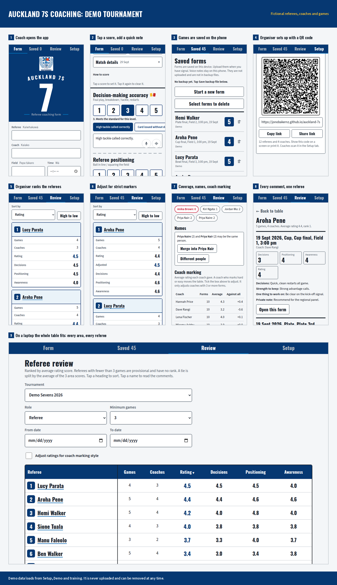

# Sevens Coaching Form

A phone app for rugby referee coaches at sevens tournaments. A coach scores a game, saves it on the phone, and
uploads it. Organisers rank referees across many games and coaches.

It is a progressive web app: plain HTML, CSS and JavaScript, with no build step. A small Cloudflare Worker
(`worker/index.js`) stores results and feedback in a D1 database -- see "Results, feedback and the Worker" below.
The app itself works offline.



## What it does

**Coaches**
- Score 8 areas from 1 to 5: fitness, foul play, breakdowns, set phase, game awareness, game management, communication, and an overall rating.
- Tap quick notes, add comments, and write "Strength to keep" and "One thing to work on".
- Write private notes that are left out of the summary, email and print.
- Dictate into any comment box: tap the microphone and speak, and the words are typed in. Say "full stop", "comma", "question mark" or "new line" for punctuation.
- Record a voice note in any comment box (the 8 areas, distance from contest, the two feedback boxes and private notes). Play it back, record again, delete it, or share it.
- Save on the device, upload with one tap, email or share a summary, print or save a PDF.
- Work offline. Forms wait on the phone until there is signal.
- Send feedback about the app from Setup, straight to the organiser.

**Organisers**
- Make a setup link and QR code with the tournament name, a tournament code, and lists of fields, levels, coaches and referees.
- Rank referees, with provisional marks for few games, coach marking style adjustment, a coverage list, and a name merge tool.
- Load a results file (CSV or JSON) and export the ranking as CSV.

**Demo**
- Setup, then Demo and training, loads 45 made-up games. Demo forms are never uploaded.

## Release notes

See [docs/RELEASE_NOTES.md](docs/RELEASE_NOTES.md) for what changed in each release, a troubleshooting table for support, and a data and privacy summary.

## Files

| Path | What it is |
| --- | --- |
| `index.html` | The whole app: page, styles and script |
| `sw.js` | Service worker for offline use |
| `manifest.webmanifest` | Install details |
| `icons/`, `fonts/` | App icons and the Barlow fonts (SIL Open Font License) |
| `lib/` | QR code maker and QR scanner. Loaded only when used. See `lib/LICENSES.txt` |
| `demo/` | Made-up tournament data: `demo.json`, plus a CSV and a backup file for testing |
| `tools/` | Scripts that make the demo data and the icons |
| `docs/` | Release notes and the demo overview picture |
| `.github/workflows/` | Runs `node tools/check.js` on every pull request |
| `worker/index.js` | The Cloudflare Worker: serves the app and the `/api/results` and `/api/feedback` routes |
| `migrations/` | D1 database schema (`0001_init.sql`) |
| `wrangler.toml` | Wires the Worker, the static-assets binding and the D1 binding together |

## Run it on your computer

```
python3 -m http.server 8000
```

Open http://localhost:8000. Service workers and the camera work on `localhost`. Phones need HTTPS. This serves the
front end only -- `/api/results` and `/api/feedback` do not exist this way, so uploads and feedback report
"offline". To exercise those too, run `wrangler dev` instead (it can use a local D1 database, so no live
Cloudflare account access is needed just to test).

## Deploy

The site is hosted on **Cloudflare** (a Worker with static assets): <https://coach7srefs.nz>. Cloudflare's own
GitHub integration deploys automatically a short time after every push to `main` -- no workflow or secret is
needed in this repo for it. Merging a pull request to `main` is what puts a change live, so treat every merge as
a release.

Two earlier addresses are retired. Do not use or link either of them:

- `https://jonobakernz.github.io/sevens-coaching-form/` -- GitHub Pages. Now returns 404: Pages does not work on a
  private repository on the Free plan, and the repo is private again (see below).
- `https://easy-goingcrow.staticdomains.app/` -- static.app, the original host. The GitHub Actions workflow that
  used to deploy there has been removed, so this address is now frozen at whatever it last had (release 21's code,
  from before the CSP problem was even diagnosed) and will never update again. static.app itself also sends a
  security header that silently blocks results and feedback from reaching SnapItForms, so it never worked properly
  regardless.

Phones cache the app for offline use, so a release does not reach everyone straight away. `sw.js` refreshes its
cached files in the background each time the app opens; once a phone has the new files, it picks them up after
two opens. Bump `CACHE` in `sw.js` by hand if you ever need every phone to drop its old cache in one go -- nothing
does this automatically.

## Repo privacy

**This repo is private.** It was made public for a period (releases 22 to 24) purely because GitHub Pages does not
support private repositories on the Free plan; moving to Cloudflare removed that restriction, so it went back to
private. If it is ever made public again for any reason, the same care applies as before:

- No real coaching data, referee names, or coach names should ever go into this repo. Real results and feedback
  live in the D1 database. The repo should only ever hold fictional demo data (see `demo/`).
- `UPLOAD_KEY` in `index.html` sits in plain sight regardless of repo visibility, since it is already visible
  to anyone who views the live page's source. It is not a security secret -- anyone who has it can write junk rows
  into the database, so do not advertise it beyond what is needed to run the app. `ADMIN_KEY` is different: it is a
  real secret, set only with `wrangler secret put ADMIN_KEY`, and must never appear in this repo.
- `CLAUDE.md`'s rule about never putting real names in the repo applies at all times, not just while it is public.

## Results, feedback and the Worker

Coaching-results uploads and in-app feedback are stored in this site's own Cloudflare D1 database, written
through the Worker in `worker/index.js`. This replaced [SnapItForms](https://snapitforms.com/), a third-party
form backend used briefly as a trial (Sept 2026) with no independent track record -- see
[docs/RELEASE_NOTES.md](docs/RELEASE_NOTES.md) for that history.

- `POST /api/results` and `POST /api/feedback` accept an upload and a feedback message. Each needs the
  `X-Upload-Key` header to match the Worker's `UPLOAD_KEY` secret -- `UPLOAD_KEY` near the top of `index.html`
  must hold the same value, or uploads and feedback will do nothing. `node tools/check.js` fails on the
  placeholder value on purpose, so a deploy with no key configured is caught before it goes out.
- `GET /api/results?key=...` (CSV by default, `&format=json` for JSON) and `GET /api/feedback?key=...` are the
  organiser-only export, gated by `ADMIN_KEY` -- a real secret, set once with `wrangler secret put ADMIN_KEY` and
  never written to a file.
- One-off setup for a new environment: `wrangler d1 create sevens_results`, paste the database ID it prints into
  `wrangler.toml`, run `wrangler d1 execute sevens_results --remote --file=migrations/0001_init.sql`, then
  `wrangler secret put UPLOAD_KEY` and `wrangler secret put ADMIN_KEY`.
- If a submission fails for a reason other than "no signal" (the Worker down, a rejected key), the coach sees a
  generic failure message. Either way the form or the feedback text stays on the phone until it sends -- nothing
  is lost.
- Do not add or rename fields in `UP_FIELDS` (`index.html`) without a plan. Anyone exporting a CSV, or loading an
  older one, expects the column names to stay put. `node tools/check.js` catches an accidental change. The D1
  schema (`migrations/0001_init.sql`) stores each submission as JSON, so it does not need to change when
  `UP_FIELDS` does.
- Nothing in the app reads results back live. Ask the organiser to hit the export URL, then use Review, then
  Load results file.

## Data on the phone

- Forms live in each phone's browser storage. Tell coaches to save a backup file after each event.
- Voice notes are audio clips kept in the phone's IndexedDB. They are **not** uploaded and **not** in backup
  files. Share summary sends them with the text where the phone allows it. The email button cannot attach files.
  Clips are limited to 2 minutes (`VN_MAX` in `index.html`). For text the organiser can read, use the microphone
  on the phone keyboard.
- Deleting a form deletes its voice notes.
- Dictation uses the browser's Web Speech API (`SpeechRecognition`). **It sends the audio to the browser maker's
  speech service** (Google on Android Chrome, Apple on iPhone). It needs signal, shows a one-time warning, and
  can be switched off in Setup. It is hidden in browsers without the API (Firefox, and some iPhone Home Screen
  apps). Te reo Māori words often come out wrong. Voice notes are separate: they stay on the phone.
- Dictation and voice notes both use the microphone, so only one can run at a time.
- On iPhone, Safari and the Home Screen icon keep separate storage. Install first, then always open from the
  icon.
- The tournament code is a filter, not a password. Anyone who has it can send results.
- Results name real people. Keep exports and the D1 database's `ADMIN_KEY` private, and follow your privacy rules
  (for example the NZ Privacy Act 2020).

## Change the content

- **Score wording:** `ANCHORS` at the top of the script in `index.html`.
- **Areas and quick notes:** the `SECTIONS` list.
- **Te reo Māori labels:** the `<i lang="mi">` tags in the form. Have a fluent speaker check them.
- **Colours and type:** the CSS variables at the top of the styles. There are light, dark and sun themes.
- **Demo data:** edit and run `python3 tools/generate_demo.py`.

## Checks and Claude Code

- `node tools/check.js` runs quick checks: scripts parse, manifest and cached files exist, the upload fields have not changed by accident, and no keys are in the files. The **Checks** workflow runs it on every pull request.
- `CLAUDE.md` holds the rules for Claude Code. It works on a branch and opens a pull request. You merge it, and the merge deploys.

## Tests

There is no test suite in the repo. The app was checked with Playwright on phone-size screens, an accessibility
scan (axe), a fake camera for QR scanning, a fake microphone for voice notes, and a mock of `fetch` for the
Worker's upload and feedback routes. Real speech recognition and a real Worker/D1 round trip have not been
tested. Add your own tests if you grow the app.

## Licence

No licence is set for the app code. The repo is private now, so this is less urgent than it was during the period
it was public -- but it is still worth a deliberate choice if this is ever shared or made public again. With no
licence file, default copyright applies: nobody else has legal permission to copy, modify or reuse the code. Add a
`LICENSE` file if you want to state something different. Third-party code and fonts keep their own licences (see
`lib/LICENSES.txt` and `fonts/LICENSE.txt`).
